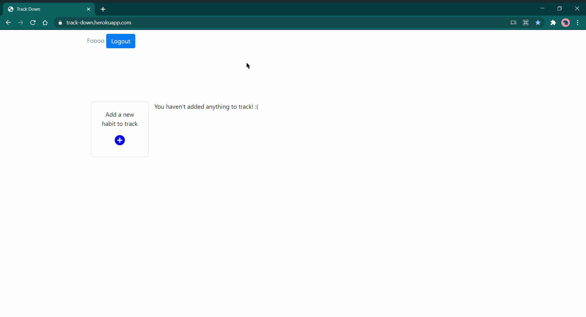

# [Track Down](https://track-down.herokuapp.com/)

> Let's track our habits with Track Down!



## Tech Stack
**Front End**
- React
- HTML
- SASS
- Bootstrap

[**Back End**](https://github.com/Madhubalajb/Track-Down-Backend)
- Node
- Express
- MongoDB

## Dependencies
1. [Node Js](https://nodejs.org/en/download/)

## Getting Started
1. Install dependencies  
```
npm install
```
2. Launch the development server  
```
npm start
```
## What I have Used
* [Visual Studio Code](https://www.sublimetext.com/3) - A light weight and sophisticated text editor
* [SASS](https://sass-lang.com/) - The Syntactically AWESOME guy
* [Google Fonts](https://fonts.google.com/) - Collection of beautiful fonts


 <p align='center'><b>Happy Coding :)</b></p>